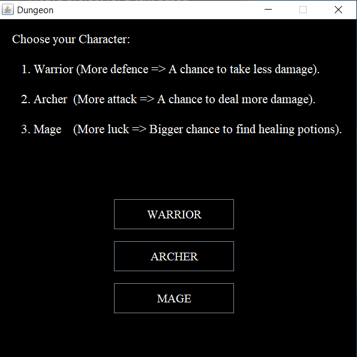
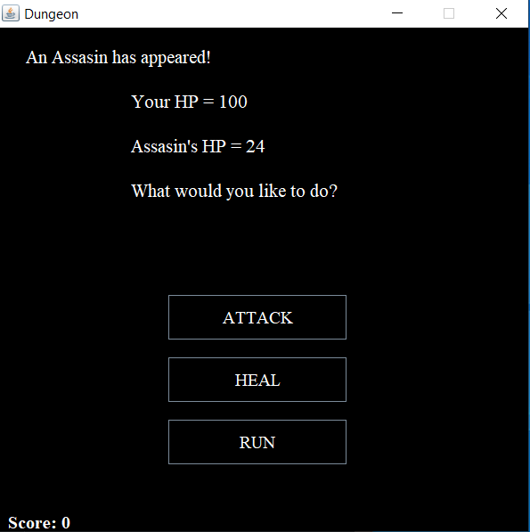
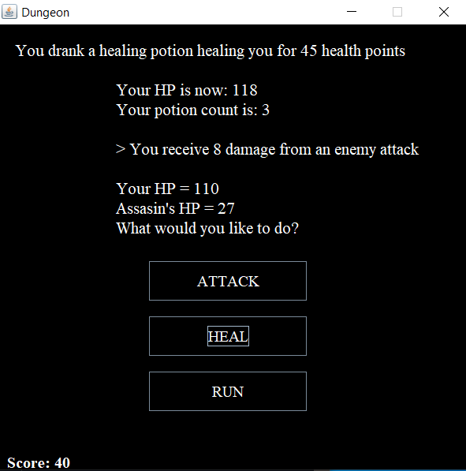

# Dungeon-Run-Game
A Java project for a text based dungeon run game with UI and sounds.

This is a Java project. After you run the Main class, then you will be able to play a dungeon run in the frame that will appear. 

There are 3 different classes to chose from: Warrior, Archer and Mage.

There are also 4 different options for enemies to appear: Skeleton, Zombie, Assassin and Ancient Dragon. 

Each character class, has its own buff. As an Archer there is a chance to deal more damage, as a Warrion there is a chance to take less damage and as a Mage, there is a bigger chance to find healing potions.

The enemies appear randomly every time, and except the ancient dragon, all the others have random hp. 

After choosing your character, you will get 3 free healing potions. 

In every fight, you have 3 options: Attack, Drink healing potion or Run from the enemy. After fleeing successfully or killing the enemy, you get to choose between continuing fighting in the dungeon or exiting the dungeon. 

Also every time you kill an enemy, you get a chance to find a healing potion. If the enemy is a dragon, then you get a potion 100%.

You can end the game bu either exiting the dungeon or dying while fighting.

<a href="https://drive.google.com/file/d/1tJhluPegbxUkJaG4BN3xhYTm15ASHbUq/view">Download Link</a> to play the game:
```
https://drive.google.com/file/d/1tJhluPegbxUkJaG4BN3xhYTm15ASHbUq/view 
```

## Game Images
###### Game start screen


###### In game screenshots


###### Some of the given choices




###### Ending Screen

